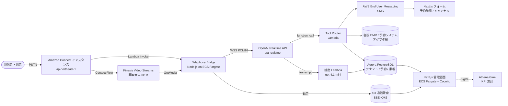

# 医療機関向け AI 電話 SaaS 実装プラン

## Context
日本の医療機関 (病院 / クリニック / 健診センター / 薬局) では、診察予約・健診予約・問合せの電話が日中の事務負担として恒常化しており、Dr.JOY「AIコール」では「応答率 18% → 65%、平均応対 10 分 → 3〜5 分」の改善実績が公表されている (Dr.JOY 公式の事例より)。本リポジトリ `AICallCenter2` はこの機能セットを **OpenAI Realtime API (gpt-realtime) + Amazon Connect** で再実装する SaaS。リポジトリは現時点で `README.md` と `.gitignore` のみのグリーンフィールド状態であり、本プランは初回コミット〜MVP リリースまでのモノレポ骨格 + 主要ユースケース 1 本 (代表電話への応答 → 診察予約) を通すための土台を確定させる。前提プラン `idempotent-spinning-pillow.md` はリモート実行環境では既に揮発しているため、本ファイルが正式な精緻化版となる。

## 参照: Dr.JOY AIコール 機能パリティ
| カテゴリ | Dr.JOY の機能 (公開情報) | 本プロダクトでの実装方針 |
|---|---|---|
| 着信応答 | 24/365、100 回線同時、方言対応 | Amazon Connect (ap-northeast-1) のクラウド PBX + gpt-realtime |
| ヒアリング | 受診コース・オプション・問合せ自動聴取 | Realtime API のセッション + JSON Schema 制約付き function tool |
| データ化 | テキスト化 + ヒアリング項目単位の自動抽出 | Realtime の transcript event + 後段 LLM extractor (`gpt-4.1-mini`) |
| 予約 | 診察 / 健診の 24h 予約 | Tool: `book_appointment` (テナント別 EMR / 予約 API アダプタ) |
| キャンセル | SMS のみで完結 | AWS End User Messaging SMS + 短縮 URL → Next.js キャンセル画面 |
| オプション追加 | 入電内容を確認して登録 | 管理画面側の承認キューで人間が登録 |
| 管理画面 | 通話一覧 / 対応ステータス / 絞り込み / 音声確認 | Next.js Admin: 通話テーブル、Audio player、ステータス遷移 |
| Web ワンタップ | HP からブラウザで AI 電話に接続 | WebRTC widget → Connect Chat/Voice (TaskFlow) |
| レポート | 応答率・応対時間など KPI | Athena + QuickSight Embedded、または React + Recharts |
| マルチ業態 | 病院 / クリニック / 健診 / 薬薬連携 | テナント設定でフロー & スクリプトを切替 (MVP は病院 1 形態) |

## アーキテクチャ

要点:
- **音声経路**: Connect Contact Flow で「メディアストリーミングを開始」→ Lambda 起動 → ECS の telephony-bridge コンテナが KVS から PCM を pull し、Realtime API へ WSS で push。返り音声 (g711/PCM) は Connect の `StartContactStreaming` 応答ストリームへ書き戻す。新規プロジェクトのため、Realtime API の **SIP transport** が安定し次第そちらに切替えるオプションを残す (回線品質と料金で比較)。
- **ツール実行**: Realtime セッションは ECS 内で保持。`tools` は内部 HTTP で Lambda Tool Router を呼び出し、テナント別のアダプタ (Mock / メディコム / CLIUS など) を `strategy` パターンで差し替える。MVP は Mock アダプタのみ。
- **データ抽出**: 通話終了時に完全な transcript を `extractor` Lambda で再パースし、ヒアリング項目 (氏名カナ・生年月日・症状・希望日時など) を JSON Schema へ正規化して RDS に保存。
- **録音 & PII**: 録音は S3 (バケット名 `aicc2-recordings-${env}`) に SSE-KMS で保管、ライフサイクル 30 日 → Glacier。transcript は RDS 上で列単位の `pgcrypto` 暗号化。
- **コンプライアンス**: 「医療情報システムの安全管理に関するガイドライン (3省2ガイドライン)」前提に、リージョンは Tokyo 固定、IAM は SCP で他リージョン拒否、監査ログは CloudTrail + 専用ログアカウントへクロスアカウント配信。

## リポジトリ構造 (初回コミットで作成)
```
.
├── README.md                      # 既存。Phase 1 完了時に追記
├── pnpm-workspace.yaml
├── turbo.json
├── package.json                   # workspaces: apps/*, packages/*
├── tsconfig.base.json
├── .nvmrc                         # 20.11
├── apps/
│   ├── telephony-bridge/          # KVS ↔ Realtime API ブリッジ (Node 20, fastify, ws)
│   │   ├── src/index.ts
│   │   ├── src/realtime/session.ts
│   │   ├── src/kvs/reader.ts
│   │   ├── src/connect/responder.ts
│   │   └── Dockerfile
│   ├── admin-web/                 # Next.js 14 App Router、Cognito Hosted UI
│   │   ├── app/(auth)/...
│   │   ├── app/calls/page.tsx
│   │   └── app/calls/[id]/page.tsx
│   ├── patient-form/              # SMS リンク先 (予約確認 / キャンセル)
│   │   └── app/r/[token]/page.tsx
│   └── tool-router/               # Lambda (Node 20) - SAM/CDK で配備
│       └── src/handlers/{book,cancel,faq,handoff}.ts
├── packages/
│   ├── db/                        # Prisma schema + migrations
│   │   └── prisma/schema.prisma
│   ├── shared/                    # zod スキーマ、tool 定義、JSON Schema 共通
│   │   └── src/tools.ts
│   └── prompts/                   # 業態別プロンプト & スクリプト (YAML)
│       └── hospital/general.yaml
├── infra/                         # AWS CDK v2 (TypeScript)
│   ├── bin/aicc2.ts
│   └── lib/{network,connect,kvs,ecs,rds,sms,cognito,observability}-stack.ts
├── contact-flows/                 # Amazon Connect Flow JSON
│   └── inbound-main.json
└── .github/workflows/
    ├── ci.yml                     # lint / typecheck / unit
    └── deploy-dev.yml             # CDK deploy --require-approval never (dev)
```

## データモデル (Prisma 抜粋 — `packages/db/prisma/schema.prisma`)
- `Tenant(id, slug, kind ENUM[hospital,clinic,medicalcenter,pharmacy], emr_adapter, created_at)`
- `Call(id, tenant_id, connect_contact_id, started_at, ended_at, status ENUM[answered,handed_off,abandoned], recording_s3_key, transcript_jsonb, extracted_jsonb, sms_sent bool)`
- `CallStatus(call_id, state ENUM[new,in_progress,done,needs_human], assignee_id, updated_at)`
- `Appointment(id, tenant_id, patient_external_id, slot_at, course, options jsonb, source ENUM[ai_call,web,manual], call_id?)`
- `SmsToken(token, call_id, purpose ENUM[confirm,cancel,form], expires_at)`
- `AuditLog(id, actor, action, target, payload jsonb, at)`

## Phase 計画 (MVP → v1)
依存順なので上から実装:

1. **Infra 基盤 (CDK)**: VPC, ECS cluster, Aurora Serverless v2, S3, KMS, Cognito UserPool, SES/EUM, Athena ワークグループ。出力は SSM Parameter Store にエクスポート。
2. **Amazon Connect セットアップ**: インスタンス (ap-northeast-1)、Claimed Phone Number 1 本、Contact Flow (`contact-flows/inbound-main.json`) の import スクリプト。Flow は (a) 営業案内 → (b) `StartMediaStreaming` → (c) Lambda invoke (`InvokeAndPipeMedia`) → (d) Hold Music while AI 応答。
3. **Telephony Bridge MVP**: KVS Reader (Matroska パーサ — `mkv.js` 利用)、Realtime WSS クライアント (system prompt は `packages/prompts/hospital/general.yaml`)、戻り音声を `UpdateContactAttributes` + DTMF/whisper で Connect に返す。再接続 / バックプレッシャ / barge-in を実装。
4. **Tool Router & Mock EMR**: `book_appointment` / `cancel_appointment` / `lookup_slot` / `handoff_to_staff` の Lambda。スキーマは `packages/shared/src/tools.ts` の zod 定義を JSON Schema にコンパイルして Realtime へ登録。
5. **SMS フロー**: 予約成立で `SmsToken` を発行 → `https://form.aicc2.example/r/{token}` を SMS 送信 (AWS End User Messaging Social/SMS, 送信元はテナント別)。キャンセル動線は token を verify して `Appointment.status` を更新。
6. **Admin Web**: 通話一覧 (テーブル: 着信時刻 / 発信番号マスク / 抽出サマリ / ステータス / 音声プレイヤー)、詳細ページで transcript と抽出 JSON を並べて表示、ステータス遷移 (`new → in_progress → done` or `needs_human`)。Cognito でテナント絞り込み (`custom:tenant_id`)。
7. **観測性**: OpenTelemetry → ADOT collector → CloudWatch + X-Ray。Realtime API 側のレイテンシ (audio_in_ms, first_token_ms, e2e_ms) と call cost を Athena テーブルへ。
8. **KPI レポート**: Athena ビュー: `daily_answer_rate`, `avg_handle_time`, `cost_per_call`。Admin に Recharts でグラフ表示。
9. **v1 拡張 (本プランの範囲外、後続プランで)**: 業態別フロー (健診 / 薬薬連携)、Web ワンタップ (Amazon Connect Chat Widget の Voice 化)、EMR 実アダプタ、ハンドオフ時のリアルタイム転送、PMS 連携、複数言語 (やさしい日本語 / 英語)。

## 重要ファイル (実装時に必ず触れる場所)
- `infra/lib/connect-stack.ts` — Connect インスタンスは CDK L1 (`CfnInstance`) + カスタムリソースで Flow を import。
- `apps/telephony-bridge/src/realtime/session.ts` — Realtime API への WSS 接続、`response.create` / `input_audio_buffer.append` / `conversation.item.create` の制御、関数呼び出しを Tool Router へ HTTP forward。barge-in は `response.cancel`。
- `apps/telephony-bridge/src/kvs/reader.ts` — `aws-sdk/client-kinesis-video-media` の `GetMedia` を Matroska パースして 8kHz PCM16 → Realtime 入力 (24kHz か `g711_ulaw` どちらにするかは Realtime 仕様確認のうえ `g711_ulaw` で開始しコスト最小化)。
- `apps/tool-router/src/handlers/book.ts` — Tenant の EMR adapter を `Strategy` で解決。MVP は `MockEmrAdapter` で Aurora の `Appointment` に直接 insert。
- `packages/shared/src/tools.ts` — Realtime に登録する tool 定義の単一ソース (zod → JSON Schema)。
- `packages/prompts/hospital/general.yaml` — system prompt と「受診コース / オプション / 折り返し希望」のヒアリング項目定義 (Dr.JOY のヒアリング項目に相当)。
- `contact-flows/inbound-main.json` — Connect Flow。`Set contact attributes` → `Start media streaming` → `Invoke Lambda`(bridge 起動) → `Loop prompts`(無音/保留音) → 終了時 `Stop media streaming`。
- `apps/admin-web/app/calls/[id]/page.tsx` — transcript と抽出 JSON、Audio HLS プレイヤー (S3 presigned URL)、ステータス変更 UI。

## 既存資産の再利用
- AWS 公式サンプル [`amazon-connect/amazon-connect-realtime-transcription`](https://github.com/amazon-connect/amazon-connect-realtime-transcription) の KVS 読み取り部 (Java) を **TypeScript に移植する代わりに参照実装として残し**、Node 実装は `@aws-sdk/client-kinesis-video-media` + `ebml` パッケージで書く。
- 録音は Connect 標準録音ではなく KVS から bridge 側で WAV 化して S3 へ書く (両方持つと PII 二重保管になるため Connect 側録音は無効)。
- 同一の zod 定義から (a) Realtime tool schema、(b) Lambda 入力 validation、(c) admin の型を生成し、二重定義を避ける。

## Verification (受け入れ確認)
1. **Infra**: `cd infra && pnpm cdk deploy --all` が dev account で成功し、SSM Parameter Store に `/aicc2/dev/*` が揃う。
2. **Telephony e2e (合成テスト)**: `apps/telephony-bridge` の `pnpm test:e2e` が、ローカルで mock KVS (固定 wav 流し込み) + mock Realtime (録音応答) で「予約成立 → DB に `Appointment` 1 行 → `SmsToken` 発行」をパスする。
3. **実電話試験**: 取得した IVR 番号に発信し、`「来週水曜の午後で内科の初診を予約したい」` と発話 → AI が氏名カナ・生年月日・症状を聴取 → `book_appointment` が呼ばれ、Admin 画面の通話一覧に 30 秒以内に表示、ステータスは `new`、抽出 JSON に `course=内科初診, preferred_at≈next_wed_pm` が入る。
4. **SMS**: 上記通話後、発信元番号宛に短縮 URL を含む SMS が届き、リンク先 (patient-form) で予約内容が確認でき、キャンセルボタンで `Appointment.status=cancelled` に遷移する。
5. **コンプラ**: `aws s3api get-bucket-encryption` で SSE-KMS が有効、CloudTrail の `LookupEvents` で全 API 呼び出しが東京リージョン内に閉じている、Aurora の `pg_stat_ssl` で全接続 SSL、Cognito MFA が必須化されている。
6. **CI**: GitHub Actions で `pnpm -w lint && pnpm -w typecheck && pnpm -w test` がグリーン。

## オープン項目 (実装着手前に決めるべき)
- Realtime API の音声 transport を **KVS bridge 方式** で始めるか、**SIP transport (直結)** で始めるか — MVP は KVS bridge (実績多い)。
- 監査ログとカルテ相当データの保管期間 (3省2ガイドラインの推奨: 診療録 5 年、それ以外は要件次第) — 法務確認。
- 録音の患者同意フロー — 着信直後の Prompt で「録音されます」を必ず告知 (Contact Flow に固定)。
